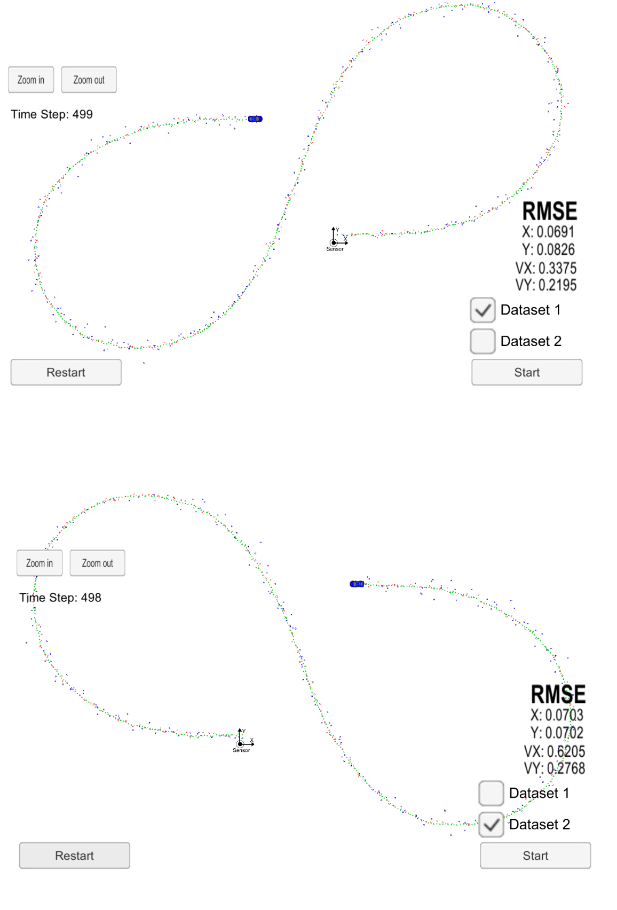

# Unscented Kalman Filter Project
Self-Driving Car Engineer Nanodegree Program

In this project we will utilize an unscented kalman filter to estimate the state of a moving object of interest with noisy lidar and radar measurements. Passing the project requires obtaining RMSE values that are lower that the tolerance outlined in the project rubric. 

This project involves the Term 2 Simulator which can be downloaded [here](https://github.com/udacity/CarND-Unscented-Kalman-Filter-Project).

This repository includes two files that can be used to set up and install [uWebSocketIO](https://github.com/uWebSockets/uWebSockets) for either Linux or Mac systems. For windows you can use either Docker, VMware, or even [Windows 10 Bash on Ubuntu](https://www.howtogeek.com/249966/how-to-install-and-use-the-linux-bash-shell-on-windows-10/) to install uWebSocketIO. Please see [this concept in the classroom](https://classroom.udacity.com/nanodegrees/nd013/parts/40f38239-66b6-46ec-ae68-03afd8a601c8/modules/0949fca6-b379-42af-a919-ee50aa304e6a/lessons/f758c44c-5e40-4e01-93b5-1a82aa4e044f/concepts/16cf4a78-4fc7-49e1-8621-3450ca938b77) for the required version and installation scripts.

Once the install for uWebSocketIO is complete, the main program can be built and run by doing the following from the project top directory.

- Clone this repo: **git clone https://github.com/moh7/CarND-Extended-Kalman-Filter-Project.git**
- Enter into directory: **cd ~/<repository>**
- Make build directory: **mkdir build && cd build**
- Compile the code: **cmake .. && make**
- Run the code: **./UnscentedKF**
- Start and run Project 1/1 EKF and UKF of Self Driving Car Simulator

Here is the main protcol that main.cpp uses for uWebSocketIO in communicating with the simulator.

INPUT: values provided by the simulator to the c++ program

["sensor_measurement"] => the measurement that the simulator observed (either lidar or radar)

OUTPUT: values provided by the c++ program to the simulator

["estimate_x"] <= kalman filter estimated position x
["estimate_y"] <= kalman filter estimated position y
["rmse_x"]
["rmse_y"]
["rmse_vx"]
["rmse_vy"]

---

## Other Important Dependencies

* cmake >= 3.5
  * All OSes: [click here for installation instructions](https://cmake.org/install/)
* make >= 4.1 (Linux, Mac), 3.81 (Windows)
  * Linux: make is installed by default on most Linux distros
  * Mac: [install Xcode command line tools to get make](https://developer.apple.com/xcode/features/)
  * Windows: [Click here for installation instructions](http://gnuwin32.sourceforge.net/packages/make.htm)
* gcc/g++ >= 5.4
  * Linux: gcc / g++ is installed by default on most Linux distros
  * Mac: same deal as make - [install Xcode command line tools](https://developer.apple.com/xcode/features/)
  * Windows: recommend using [MinGW](http://www.mingw.org/)
  
  
## Results

 

### Accuracy

For the new data set, your algorithm will be run against "obj_pose-laser-radar-synthetic-input.txt". The prgram will collect the positions that the UKF algorithm outputs and compares them to ground truth data. The px, py, vx, and vy RMSE should be less than or equal to the values [.09, .10, .40, .30] to pass this project.

The RMSE values obtained by using the UKF algorithm ware:

Dataset 1 : RMSE <= [0.0691, 0.0826, 0.3375, 0.2195]

Dataset 2 : RMSE <= [0.0703, 0.0702, 0.6205, 0.2768]

which meet the project accuracy requirements.

In comparison, the RMSE values for the [Extended Kalman Filter](https://github.com/moh7/CarND-Extended-Kalman-Filter-Project) were:

Dataset 1 : RMSE <= [0.0954, 0.0837, 0.4499, 0.4357]

Dataset 2 : RMSE <= [0.0744, 0.0959, 0.4588, 0.4947]

which are higher than the values obtained by UKF.
